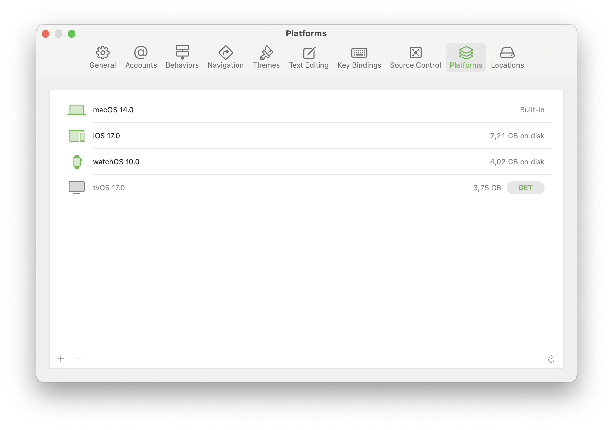
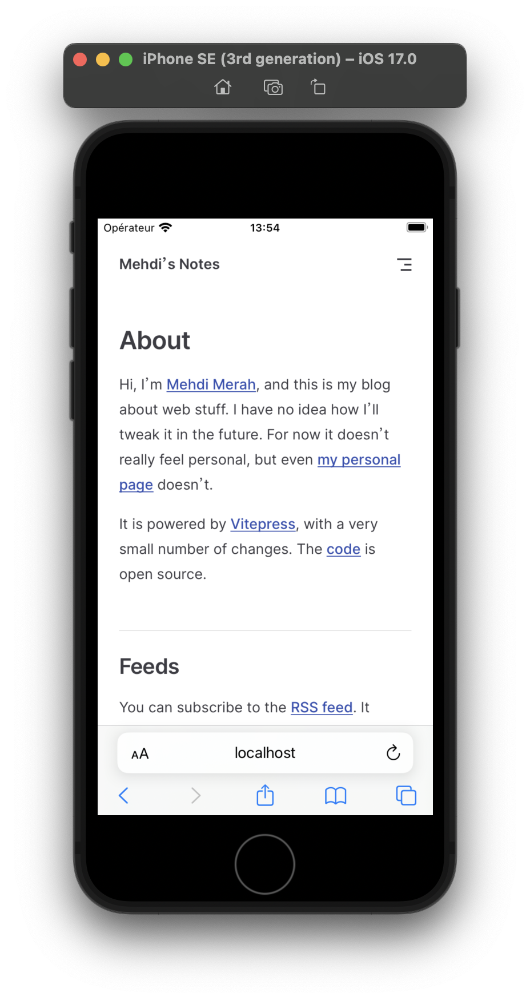
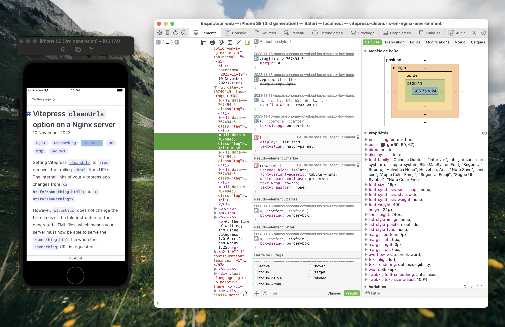

Since [macOS Sonoma](https://www.apple.com/macos/sonoma/) (codename for macOS 14), [Xcode](https://developer.apple.com/xcode/) doesn’t include any iOS Simulator anymore, so it’s now 50% lighter to download (3.2 GB instead of 7 GB), which is nice… except when your bandwidth sucks.

---
# Downloading Xcode Simulators on macOS Sonoma when the bandwidth is slow

<datetime :date="$frontmatter.publishedAt" formatter="longdate"/>

There’s one question you might have before we jump in:

> I’m a web developer, should I care about the iOS Simulator?

Yes! If you are doing web development and wonder if you should install the iOS Simulator, jump to the [last section](#what-are-xcode-simulators-by-the-way).

## How to download the iOS Simulator

### Fail: the traditional way

On macOS, you would normally open Xcode and hit the “get” button from _Settings_ / _Platforms_.

<picture>
    <source media="(prefers-color-scheme: dark)" srcset="../public/content/xcode-settings-platforms-dark.webp" type="image/webp"/>
    <source media="(prefers-color-scheme: dark)" srcset="../public/content/xcode-settings-platforms-dark.png" type="image/png"/>
    <source media="(prefers-color-scheme: light)" srcset="../public/content/xcode-settings-platforms-light.webp" type="image/webp"/>
    
</picture>

My connexion is slow and peak at 21 Mbps (2.6 MB/s.), and downloading from that menu is more often in the 0.1 to 1 MB/s range, and even worse: it will fail after around 2 hours **with no possibility to resume the failing download**!

### Fail: same player try again with the command line

Alternatively, the download can be triggered from the command line:

```sh
xcodebuild -downloadPlatform iOS
```

But unfortunately, it’s as slow as a download from the Xcode app, and you’ll get kicked out the same way after a while without the ability to resume the download. At least the experience is consistent…

### Success: use Safari

Fortunately, along with the [previous method documentation](https://developer.apple.com/documentation/xcode/installing-additional-simulator-runtimes#Install-and-manage-Simulator-runtimes-from-the-command-line) comes a way simpler way to proceed: go to the [Apple developer downloads website](https://developer.apple.com/download/all/?q=ios%20Simulator%20runtime) (you have to login with an Apple ID) and download the Simulator runtime `.dmg` file directly from Safari: the download was way faster for me, and it can be resumed if it fails (it did not for me but I checked, for science and for you 😘).

Once you have downloaded the simulator file, add it to Xcode with this command (make sure to check the file path):

```sh
xcrun simctl runtime add iOS_17.0.1_Simulator_Runtime.dmg
```

The command should take around 20 seconds to run. Now you can open Spotlight and type _Simulator_.

w00t! Another dumb mystery that should not exist is now solved. 💁‍♂️

## What are Xcode Simulators, by the way?

One of the benefits of using a Macbook is that you get access to Simulators for the whole Apple ecosystem through Xcode.

Simulators allow you to test how your websites or in-development native apps behave on any iPhone and iPad without the need to purchase the devices. Using Simulators doesn’t replace the experience of having your fingers on the real devices, but they are very good and you should definitely use them.

<picture>
    <source media="(prefers-color-scheme: dark)" srcset="../public/content/simulator-mehdi-blog-dark.webp" type="image/webp"/>
    <source media="(prefers-color-scheme: dark)" srcset="../public/content/simulator-mehdi-blog-dark.png" type="image/png"/>
    <source media="(prefers-color-scheme: light)" srcset="../public/content/simulator-mehdi-blog-light.webp" type="image/webp" />
    
</picture>

Simulators are handy, robust and come with a good set of features, like the ability to use Safari macOS developer tools to inspect any Safari iOS tab. There’s an Apple WWDC 23 video about it ([from 6:42](https://developer.apple.com/videos/play/wwdc2023/10262?time=402) to 8:45).

:::details Screenshot of Safari iOS inspected from macOS.
<picture>
    <source media="(prefers-color-scheme: dark)" srcset="../public/content/ios-simulator-safari-dark.webp" type="image/webp"/>
    <source media="(prefers-color-scheme: dark)" srcset="../public/content/ios-simulator-safari-dark.png" type="image/png"/>
    <source media="(prefers-color-scheme: light)" srcset="../public/content/ios-simulator-safari-light.webp" type="image/webp"/>
    
</picture>

View this screenshot in a new tab in light mode ([WebP](../public/content/ios-simulator-safari-light.webp), [PNG](../public/content/ios-simulator-safari-light.png)) or in dark mode ([WebP](../public/content/ios-simulator-safari-dark.webp), [PNG](../public/content/ios-simulator-safari-dark.png)).
:::
